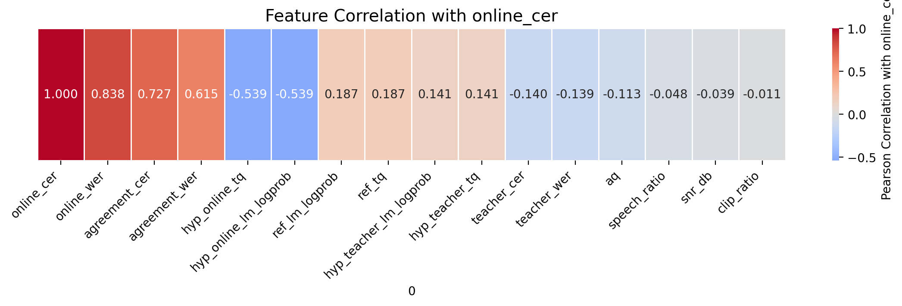

# LogLabel Booster – 终版报告

##outpus：
dev: dev_score.jsonl, manifest.jsonl
train-like: manifest.jsonl
test: manifest.jsonl
---

## 1. 数据拆分（Dev → Train/Dev）
- **策略**：随机抽取 
- **比例**：train : dev = 2 : 1  
- **随机种子**：42（可复现）  
- **脚本**：`data_split.py`

---

## 2. 文本规范化（text_normalize）
**规则**（可复现）：
1. NFKC 全半角统一  
2. 去除所有标点（保留字母数字 & 中文）  
3. 英文字母统一小写  
4. 连续空白 → 单空格并 strip  
5. **数字**：保留原始阿拉伯数字

**代码**：`./utils/text_norm.py::text_normalize()`

---

## 3. 评测基线（Online vs Teacher）
| 模型               | CER        | WER        | 备注                       |
| ------------------ | ---------- | ---------- | -------------------------- |
| Online（baseline） | 8.34 %     | 16.26 %    | -                          |
| Fast-Whisper       | 11.65 %    | 20.39 %    | 效果下降，弃用             |
| FunAudio-Nano      | **5.40 %** | **7.98 %** | 选为 Teacher               |
| FunAudio-Enhanced  | 5.59 %     | 7.98 %     | 降噪/增益 → 人工伪影，回退 |

我们尝试了基于 SNR 的音频增强策略，但发现整体 CER/WER 反而上升。分析表明，传统信号处理方法（如谱减法）引入的人工伪影对端到端 ASR 模型有害. 不降噪，只做音量归一化，效果没变
**结论**：以 **FunAudio-Nano** 作为 `text_teacher` 生成伪标签。

---

## 4. 质量信号设计
| 信号               | 来源   | 范围 | 说明                                |
| ------------------ | ------ | ---- | ----------------------------------- |
| **aq**             | 声学   | 0–1  | Clipping + VAD(Silero) + SNR_proxy  |
| **tq**             | 文本   | 0–1  | GPT-2 负对数概率映射：(logprob+8)/6 |
| **agreement_cer**  | 双模型 | 0–1  | Online vs Teacher 字符级差异        |
| **lm_logprob_gap** | 文本   | ℝ    | Teacher 比 Online 更合理时 &lt; 0   |

针对于音质测评，我们也使用了TTS常用的UTMOS测评语音自然度质量。但是效果并不好，也不是很适用于该场景。
因此，传统声学指标分析Clipping, VAD, SNR

针对于文本测评，我们引入语言模型合理性（LM Plausibility） 作为文本侧质量信号，通过预训练语言模型（PLM）对 ASR 输出文本的对数概率（log probability） 进行打分，量化其语言合理性。该方法无需额外标注，仅依赖文本本身，可有效补充音频侧指标的不足。
我们采用 uer/gpt2-chinese-cluecorpussmall，一个在大规模中文语料（CLUECorpus）上预训练的 GPT-2 架构因果语言模型。该模型：

支持中文文本的自回归概率建模；
轻量级（117M 参数），适合批量推理；
使用 CER 对齐后的文本（hyp_cer 字段）：已去除标点、转为小写、无多余空格；
保留英文术语（如 monorepo, drizzle），因其在上下文中具有语义；

为了将TQ映射在0-1范围，我们依据我们在dev上面数据统计，做出以下公式：
tq = max(0.0, min(1.0, (lm_logprob + 8.0) / 6.0))
绝大多数合理句子的 lm_logprob 落在 -2 ~ -6
严重错误通常 < -7
-8 是一个安全下限（再低也没区分度）
-2 是高质量文本的上限（很少超过）

这里也放上各个特征的数据统计：
| 字段                      | count | mean                | std                    | min     | 25%                  | 50%                 | 75%                 | max     |
| ------------------------- | ----- | ------------------- | ---------------------- | ------- | -------------------- | ------------------- | ------------------- | ------- |
| online\_cer               | 100.0 | 0.083449            | 0.11038248424126323    | 0.0     | 0.0                  | 0.0476              | 0.12125             | 0.7143  |
| online\_wer               | 100.0 | 0.16259600000000002 | 0.17931060232192214    | 0.0     | 0.0                  | 0.12915             | 0.25                | 1.0     |
| teacher\_cer              | 100.0 | 0.048124            | 0.07674077198496562    | 0.0     | 0.0                  | 0.0                 | 0.077675            | 0.3     |
| teacher\_wer              | 100.0 | 0.07296000000000001 | 0.11119995639850899    | 0.0     | 0.0                  | 0.0                 | 0.1111              | 0.5     |
| aq                        | 100.0 | 0.9270859999999999  | 0.09662011315801004    | 0.4979  | 0.9014               | 0.9561999999999999  | 1.0                 | 1.0     |
| snr\_db                   | 100.0 | 30.449099999999998  | 20.939567258174076     | -3.61   | 19.16                | 23.799999999999997  | 34.385000000000005  | 104.01  |
| speech\_ratio             | 100.0 | 0.8180449999999999  | 0.13721755959648954    | 0.1588  | 0.783625             | 0.8490500000000001  | 0.898175            | 0.9905  |
| clip\_ratio               | 100.0 | 2e-06               | 1.4070529413628971e-05 | 0.0     | 0.0                  | 0.0                 | 0.0                 | 0.0001  |
| hyp\_online\_tq           | 100.0 | 0.583784            | 0.16765770126039303    | 0.143   | 0.4878               | 0.587               | 0.698075            | 0.9854  |
| hyp\_teacher\_tq          | 100.0 | 0.7264649999999997  | 0.12400049395062909    | 0.3768  | 0.64815              | 0.74095             | 0.8218              | 0.9854  |
| ref\_tq                   | 100.0 | 0.7265070000000001  | 0.12972898654697435    | 0.3768  | 0.6458499999999999   | 0.74095             | 0.8257              | 0.9854  |
| hyp\_online\_lm\_logprob  | 100.0 | -4.49729            | 1.0059530762496636     | -7.1419 | -5.072975            | -4.478              | -3.8115750000000004 | -2.0873 |
| hyp\_teacher\_lm\_logprob | 100.0 | -3.6412219999999995 | 0.7440235691362896     | -5.739  | -4.111375            | -3.5544000000000002 | -3.069225           | -2.0873 |
| ref\_lm\_logprob          | 100.0 | -3.640996999999999  | 0.7783952524140985     | -5.739  | -4.125175            | -3.5544000000000002 | -3.0460249999999998 | -2.0873 |
| agreement\_cer            | 100.0 | 0.12531478790360107 | 0.11335229499871143    | 0.0     | 0.040865384615384616 | 0.1111111111111111  | 0.17670454545454545 | 0.5     |

## 5. 决策策略（可解释）
对于决策策略，我们先进行一下各个特征与“ASR输出好坏”的相关性分析

**可视化相关性分析**（Pearson vs Online-CER）
- agreement_cer : **+0.72** （差异越大 → CER 越高）
- hyp_online_tq : **-0.54** （质量越高 → CER 越低）
- aq : **-0.11** （弱相关，模型抗噪）

强信号分析：
agreement_cer：Online 与 Teacher 差异越大 → CER 越高
hyp_online_tq：Online 文本质量分越高 → CER 越低

弱信号分析：
与音质关系不大，现有ASR模型抗噪能力强，对于音谱处理效果不会提升。个人认为，如果训练集包含音质差数据，反而对于模型鲁棒性有提升。

---

因此基于dev上面的数据统计（均值方差等），以及相关性分析。我们做出如下的策略：

硬闸门（**丢弃**）：
- aq &lt; 0.4 （dev里面最低是0.49）

软权重（**保留**）：
- 高 Online-TQ (≥0.6) → 直接用 Online
- 高差异 + 高 Teacher-TQ → Teacher 替换
- 其余默认 Online（保守）

**结果**（dev 100 条，duration 加权）
| 指标       | Baseline | Final       | Δ                    |
| ---------- | -------- | ----------- | -------------------- |
| **CER**    | 8.34 %   | **7.05 %**  | **↓1.29 %**          |
| **WER**    | 16.26 %  | **13.61 %** | **↓2.65 %**          |
| **保留率** | —        | **99 %**    | 仅丢弃 1 条,替换11条 |

### 典型案例分析

{"utt_id": "utt_000277", "audio_path": "wavs/utt_000277.wav", "text_online": "超净台 内部的空气流速需保持在 0呃.3 到 0.5  米每秒之间。", "text_teacher": "超静台内部的空气流速需保持在零点三到零点五米每秒之间。", "text_final": "超净台 内部的空气流速需保持在 0呃.3 到 0.5  米每秒之间。", "keep": true, "aq": 0.8668, "tq": 0.6743, "tags": ["high_online_tq"]}
{"utt_id": "utt_000016", "audio_path": "wavs/utt_000016.wav", "text_online": "这个 Agent 能够自动对 吉特哈布那个 尚的 issue 进行总结。", "text_teacher": "这个agent能够自动对github上的issue进行总结。", "text_final": "这个agent能够自动对github上的issue进行总结。", "keep": true, "aq": 1.0, "tq": 0.6981, "tags": ["teacher_replace", "teacher_better"]}
{"utt_id": "utt_000174", "audio_path": "wavs/utt_000174.wav", "text_online": "这哥 爱斯阿 模型对 语气词 的过滤还需要增强。", "text_teacher": "这个ASR模型对语气词的过滤还需要增强。", "text_final": "这个ASR模型对语气词的过滤还需要增强。", "keep": true, "aq": 0.9219, "tq": 0.6486, "tags": ["teacher_replace", "teacher_better"]}
{"utt_id": "utt_000172", "audio_path": "wavs/utt_000172.wav", "text_online": "我们在 反应 项目中使用了 F r a m e r   M o t i o n 库。", "text_teacher": "我们在React项目中使用了Framer Motion库。", "text_final": "我们在React项目中使用了Framer Motion库。", "keep": true, "aq": 0.7391, "tq": 0.7524, "tags": ["teacher_replace", "teacher_better"]}

> 以上案例验证了「**高差异 + 高 Teacher 质量**」才替换的保守策略有效性，同时通过硬闸门防止 Teacher 幻觉导致的标签污染。
---

## 6. 可复现性
- **一键命令**：
  bash run.sh